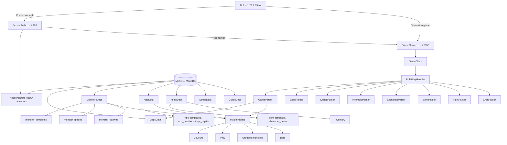
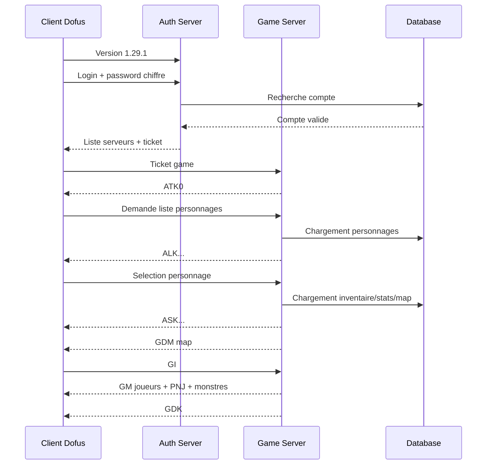
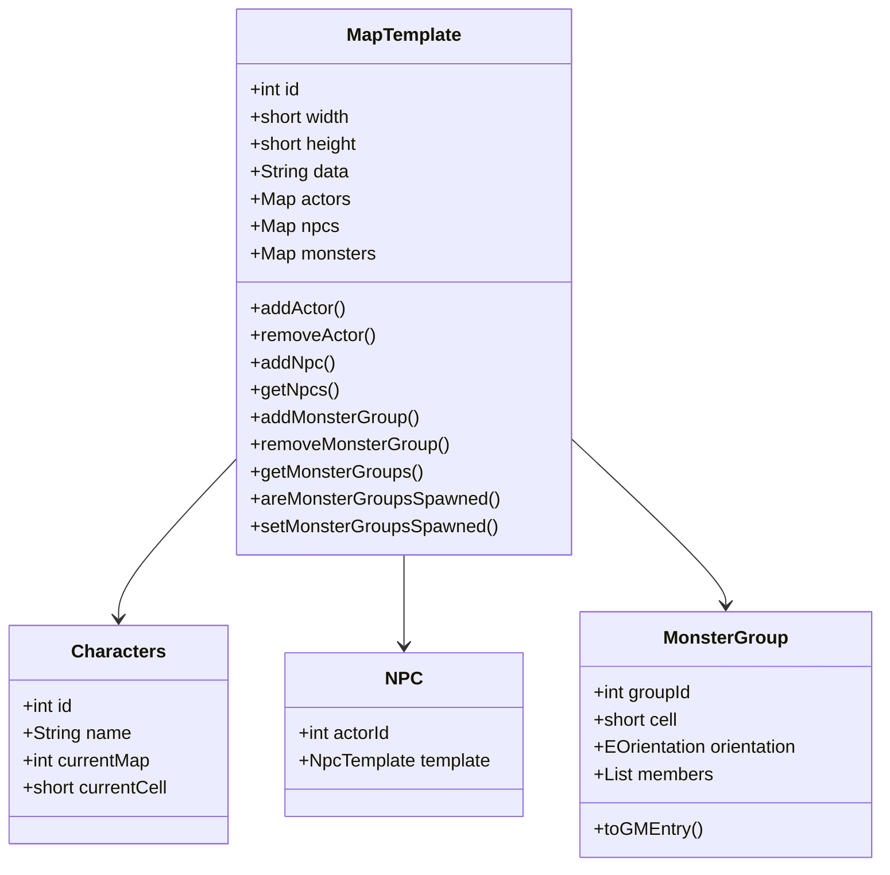
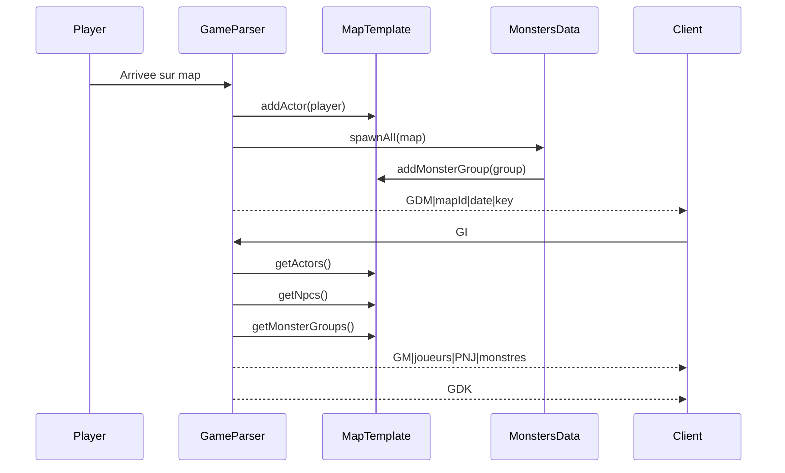
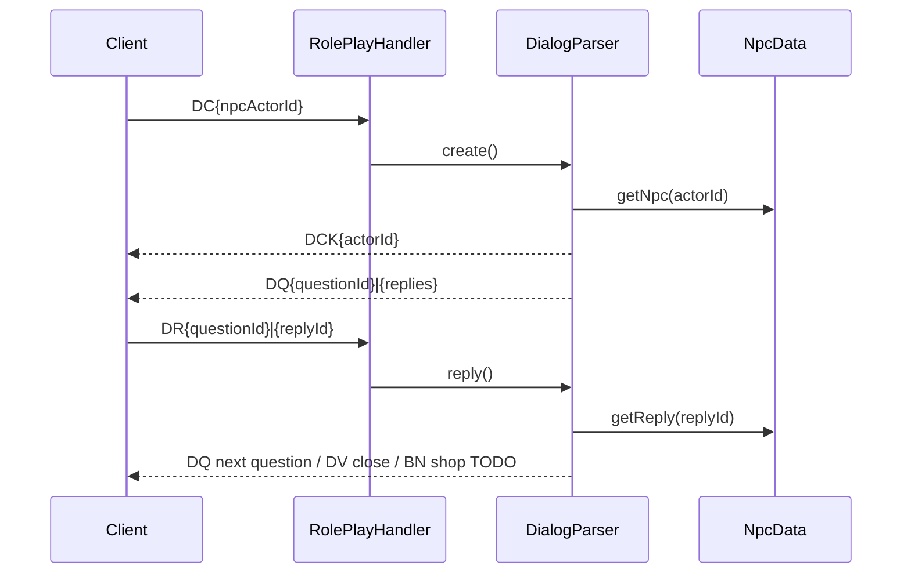
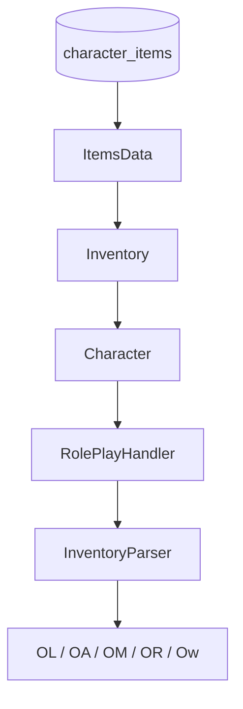
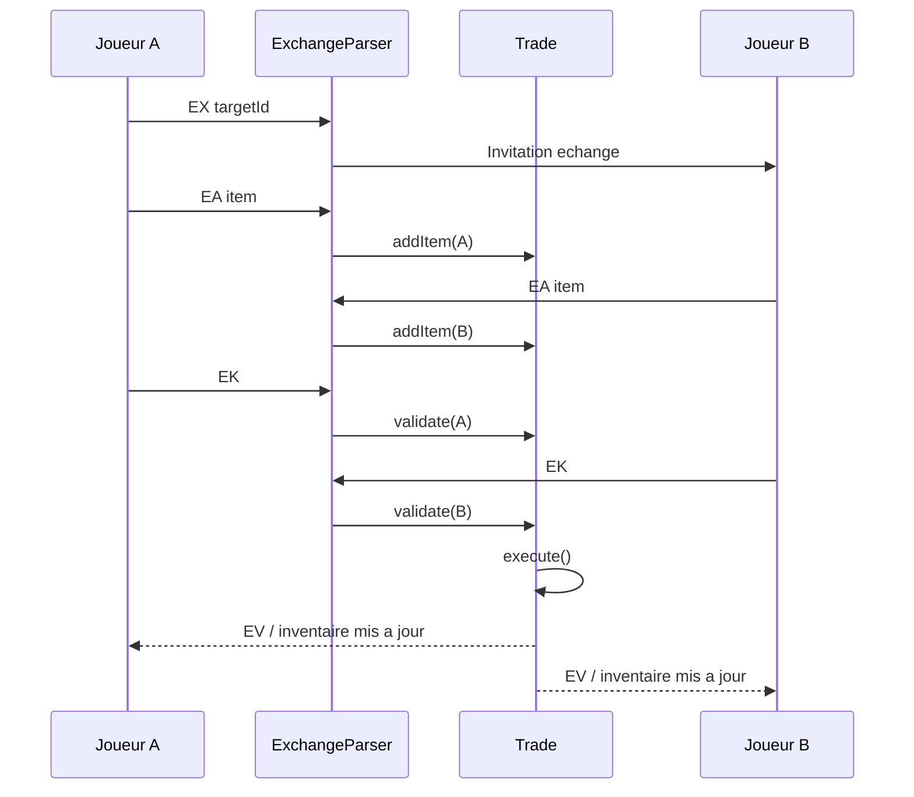
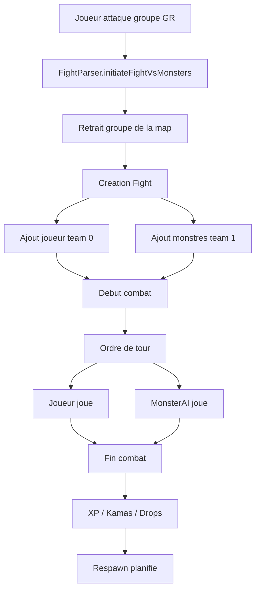
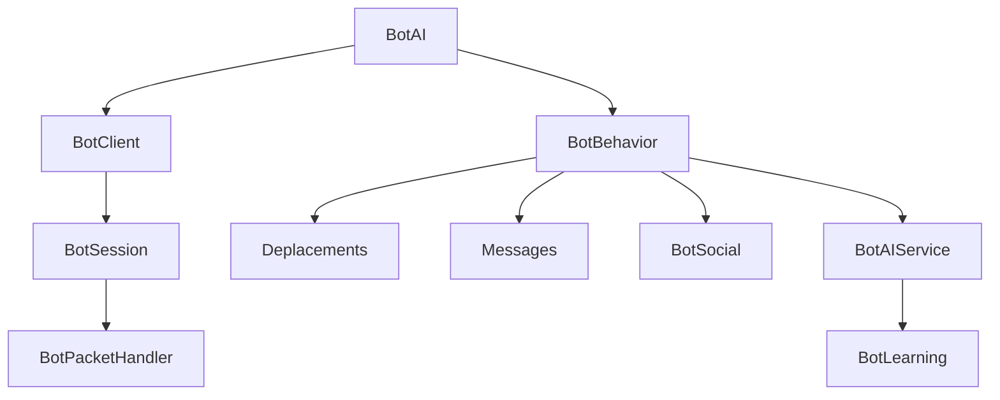

# Dofus 1.29.1 Sandbox Emulator

Version conseillee : `3.18.0-alpha.1`  
Statut : developpement actif / alpha technique  
Langage : Java  
Client cible : Dofus 1.29.1  
Base de donnees : MySQL / MariaDB  
Reseau : Apache MINA  
Objectif : emulateur Dofus 1.29 oriente apprentissage, sandbox, test serveur, systemes RPG et reconstruction progressive d'un fonctionnement Ankalike.

---

## Presentation

Ce projet est un emulateur serveur pour Dofus 1.29.1.

Il vise a reproduire progressivement les grandes couches d'un serveur Dofus 1.29 :

- authentification ;
- selection et connexion des personnages ;
- chargement des maps ;
- deplacement et changement de map ;
- affichage des joueurs, bots, PNJ et monstres ;
- systeme de PNJ et dialogues ;
- inventaire ;
- banque ;
- echange joueur-joueur ;
- artisanat ;
- sorts ;
- combat ;
- monstres et drops ;
- bots intelligents ;
- anti-spam et anti-hack ;
- logs reseau et diagnostic serveur.

Le projet n'est pas encore stable. Il est en phase `alpha`, avec beaucoup de systemes deja scaffoldes ou partiellement fonctionnels, mais certains elements doivent encore etre consolides, testes et nettoyes.

---

## Version actuelle recommandee

```text
Dofus 1.29.1 sandbox 3.18.0-alpha.1
```

Cette version correspond a une grosse etape technique incluant :

- reconstruction partielle de la base de donnees ;
- correction des commandes `.help`, `.info`, `.infos` ;
- correction du chargement des monstres ;
- ajout / correction des spawns monstres par map ;
- ajout des monstres dans le paquet `GM` ;
- correction de tables SQL importantes ;
- renforcement des systemes inventaire, banque, trade, combat, craft et anti-spam ;
- preparation d'un futur systeme de diagnostic serveur.

---

## Architecture generale



---

## Fonctionnement global du serveur

Le serveur fonctionne en deux grandes phases :

1. connexion au serveur d'authentification ;
2. entree sur le serveur de jeu.

Le client se connecte d'abord au serveur auth, generalement sur le port `499`. Apres validation du compte, le serveur renvoie l'adresse et le ticket permettant de se connecter au serveur game, generalement sur le port `5555`.

Une fois connecte au serveur game, le joueur selectionne son personnage, charge la map, puis le serveur envoie les informations necessaires au rendu cote client : map, acteurs, PNJ, monstres, inventaire, stats, sorts, etc.

---

## Cycle de connexion simplifie



---

## Structure des paquets principaux

### Authentification

| Paquet | Role |
|---|---|
| `HC` | Handshake / cle de chiffrement |
| `Af` | File / etat connexion |
| `Ad` | Pseudo compte |
| `Ac` | Droits ou communaute |
| `AH` | Liste serveurs |
| `AlK` | Connexion acceptee |
| `Ax` | Liste personnages |
| `AX` | Selection serveur |
| `AYK` | Redirection vers game server |

### Game / Roleplay

| Paquet | Role |
|---|---|
| `ASK` | Selection personnage reussie |
| `GCK` | Entree en mode game |
| `GDM` | Donnees de map |
| `GI` | Demande d'informations map |
| `GM` | Acteurs visibles sur la map |
| `GDK` | Fin chargement acteurs |
| `GA` | Action de jeu / deplacement / combat |
| `GKK` | Fin d'action |
| `BM` | Message chat |
| `D*` | Dialogue PNJ |
| `O*` | Objets / inventaire |
| `E*` | Echange |
| `B*` | Banque |
| `f*` | Combat |
| `W*` | Zaap / Zaapi |
| `Q*` | Quetes |

---

## Fonctionnement des maps

Les maps sont chargees depuis la table `map_templates`.

Chaque map est representee cote Java par un objet `MapTemplate`.

Une map contient plusieurs types d'acteurs :

- personnages joueurs ;
- bots ;
- PNJ ;
- groupes de monstres.



---

## Chargement d'une map

Lorsqu'un personnage arrive sur une map :

1. le personnage est place sur la map ;
2. les PNJ de la map sont deja disponibles via `NpcData` ;
3. les groupes monstres sont prepares via `MonstersData.spawnAll(map)` ;
4. le client recoit `GDM` ;
5. le client repond `GI` ;
6. le serveur envoie `GM` avec les acteurs visibles ;
7. le serveur envoie `GDK`.



---

## Systeme de monstres

Le systeme de monstres repose sur trois tables principales :

```text
monster_templates
monster_grades
monster_spawns
```

### `monster_templates`

Contient l'identite generale du monstre :

- `id`
- `name`
- `gfx_id`
- `race`
- `alignment`

### `monster_grades`

Contient les stats par grade :

- `monster_id`
- `grade`
- `level`
- `life`
- `ap`
- `mp`
- `strength`
- `agility`
- `intel`
- `wisdom`
- `chance`
- `res_neutral`
- `res_earth`
- `res_fire`
- `res_water`
- `res_air`
- `xp`
- `kamas_min`
- `kamas_max`

### `monster_spawns`

Contient l'emplacement des monstres sur les maps :

- `map_id`
- `monster_id`
- `grade`
- `cell_id`
- `orientation`
- `qty`

---

## Cycle de spawn des monstres

```mermaid
flowchart TD
    A[Chargement serveur] --> B[MonstersData.load]
    B --> C[loadTemplates]
    B --> D[loadGrades]
    C --> E[Cache templates]
    D --> E

    F[Chargement map] --> G[MonstersData.spawnAll(map)]
    G --> H{Templates charges ?}
    H -->|Non| I[Warn + return]
    H -->|Oui| J{Deja spawn ?}
    J -->|Oui| K[Return]
    J -->|Non| L[SELECT monster_spawns WHERE map_id = map.getId]
    L --> M[Creation MonsterGroup]
    M --> N[map.addMonsterGroup]
    N --> O[map.setMonsterGroupsSpawned true]
    O --> P[GameParser envoie GM]
```

---

## Point critique : affichage des monstres

Pour qu'un monstre soit visible cote client, trois conditions doivent etre reunies :

1. la table `monster_spawns` doit contenir une ligne pour la map ;
2. `MonstersData.spawnAll(map)` doit creer un `MonsterGroup` et l'ajouter a `MapTemplate` ;
3. `GameParser.information()` doit ajouter `map.getMonsterGroups()` dans le paquet `GM`.

Si le log affiche :

```text
GI map 7390 : 1 joueur(s), 0 PNJ, 0 groupe(s) monstre(s)
```

le probleme est dans le chargement des spawns ou dans `spawnAll`.

Si le log affiche :

```text
GI map 7390 : 1 joueur(s), 0 PNJ, 3 groupe(s) monstre(s)
```

mais que le client ne voit rien, le probleme est probablement dans le paquet `GM` ou dans `MonsterGroup.toGMEntry()`.

---

## Systeme PNJ

Le systeme PNJ comprend :

- templates PNJ ;
- apparence complete ;
- questions ;
- reponses ;
- dialogues ;
- actions de reponses.

Tables utilisees :

```text
npc_templates
npc_questions
npc_replies
```

Selon le schema utilise, les spawns PNJ peuvent etre separes ou embarques dans `spawns_json`.

### Fonctionnement dialogue PNJ



---

## Systeme de commandes

Les commandes sont envoyees dans le chat general avec le prefixe `.`.

Exemple :

```text
.help
.info
.infos
.tp 7411 200
.kamas Cheuch 10000
```

### Commandes publiques

Ces commandes ne necessitent pas de droits administrateur :

- `.help`
- `.info`
- `.infos`
- `.command`
- `.commands`
- `.commande`
- `.commandes`

### Commandes admin

Ces commandes necessitent les droits GM :

- `.kick`
- `.ban`
- `.unban`
- `.mute`
- `.unmute`
- `.goto`
- `.bring`
- `.tp`
- `.kamas`
- `.level`
- `.god`
- `.invis`
- `.announce`
- `.reload`
- `.speed`

### Parsing

Le client envoie les commandes sous forme de paquet chat :

```text
BM*|.infos|
```

Le serveur doit nettoyer :

```text
.infos|
```

pour obtenir :

```text
infos
```

avant le `switch` de `AdminParser`.

---

## Systeme d'inventaire

L'inventaire repose sur :

- `ItemTemplate`
- `Item`
- `Inventory`
- `ItemsData`
- `InventoryParser`

Tables principales :

```text
item_template
character_items
```

Fonctions presentes :

- chargement des items du personnage au login ;
- envoi du paquet `OL` ;
- calcul des pods ;
- paquet `Ow` ;
- equipement ;
- desequipement ;
- suppression ;
- mise a jour BDD.



---

## Banque

Le systeme de banque gere :

- ouverture de la banque ;
- solde kamas banque ;
- depot kamas ;
- retrait kamas ;
- depot items ;
- retrait items ;
- affichage des items dans `Bd`.

Tables :

```text
accounts.bank_kamas
bank_items
```

Paquets principaux :

| Paquet | Role |
|---|---|
| `Bd` | Ouverture banque |
| `Bk` | Depot kamas |
| `Bq` | Retrait kamas |
| `Bi` | Depot item |
| `Bo` | Retrait item |

---

## Echange joueur-joueur

Le systeme d'echange repose sur :

- `Trade`
- `ExchangeParser`
- `TradeSlot`
- `Inventory`

Fonctions presentes :

- demande d'echange ;
- acceptation / refus ;
- ajout item ;
- retrait item ;
- ajout kamas ;
- validation des deux joueurs ;
- transfert physique des kamas et items ;
- fermeture propre.



---

## Artisanat

Le systeme d'artisanat repose sur :

- `CraftParser`
- `CraftRecipe`
- `craft_recipes`
- `craft_ingredients`
- `Inventory`

Fonctions presentes :

- chargement des recettes ;
- verification reelle des ingredients ;
- craft multiple ;
- consommation des ingredients ;
- ajout du resultat ;
- mise a jour inventaire ;
- paquet `MC+` en cas de succes ;
- paquet `MC-3` en cas d'ingredients insuffisants.

---

## Combat

Le moteur de combat est en cours de developpement.

Systemes presents :

- creation de combat joueur contre groupe de monstres ;
- retrait du groupe monstre de la map ;
- fighters joueur / monstres ;
- ordre de tour ;
- lancement de sorts ;
- degats ;
- mort ;
- fin de combat ;
- XP ;
- kamas ;
- drops ;
- respawn des monstres ;
- IA de base des monstres.



---

## Drops

Le systeme de drops repose sur `DropTable`.

Fonctions presentes :

- drops par monstre ;
- taux sur 10 000 ;
- bonus prospection ;
- kamas min/max par grade ;
- drops par defaut de test.

A terme, les drops devraient etre entierement charges depuis une table SQL dediee.

---

## Bots

Le serveur contient un systeme de bots avance.

Fonctions presentes :

- bots avec IDs negatifs ;
- bots visibles comme acteurs connectes ;
- deplacement automatique ;
- messages automatiques ;
- comportements par personnalite ;
- systeme social entre bots ;
- reponse aux messages ;
- integration optionnelle avec un service IA ;
- memoire d'apprentissage par renforcement.



---

## Securite / stabilite

Systemes presents :

- pool de connexions BDD ;
- `PreparedStatement` sur les requetes critiques ;
- anti-spam chat ;
- rate limiter reseau ;
- validation centralisee des paquets ;
- protection contre certains NPE ;
- protection contre certaines race conditions ;
- sauvegarde differee ;
- logs packet console.

---

## Base de donnees

### Tables principales

```text
accounts
characters
guilds
guild_members
experience_templates
breed_templates
item_template
character_items
map_templates
map_triggers
monster_templates
monster_grades
monster_spawns
npc_templates
npc_questions
npc_replies
spell_templates
spell_levels
craft_recipes
craft_ingredients
bank_items
monster_drops
character_jobs
quest_templates
quest_steps
quest_objectives
quest_rewards
character_quests
```

### Import SQL

Le projet peut necessiter des fichiers SQL decoupes par table afin d'eviter :

```text
1153 - Got a packet bigger than 'max_allowed_packet' bytes
```

Il est recommande d'importer les fichiers dans un ordre logique :

1. tables systeme ;
2. comptes / personnages ;
3. experiences ;
4. breeds ;
5. maps ;
6. triggers ;
7. items ;
8. sorts ;
9. monstres ;
10. spawns ;
11. PNJ ;
12. craft ;
13. guildes ;
14. banque ;
15. quetes.

---

## Configuration

Le serveur doit lire ses parametres depuis `config.properties`.

Exemple :

```properties
db.host=127.0.0.1
db.port=3306
db.name=dofus
db.user=root
db.password=

server.auth.port=499
server.game.port=5555

bot.ai.enabled=false
bot.ai.key=
bot.ai.model=gpt-3.5-turbo
```

---

## Lancement

### Prerequis

- Java 8 ou compatible ;
- MySQL ou MariaDB ;
- client Dofus 1.29.1 ;
- base SQL importee ;
- `config.properties` correctement configure.

### Etapes

1. Creer la base MySQL.
2. Importer les fichiers SQL.
3. Verifier `config.properties`.
4. Compiler le projet Java.
5. Lancer `Main`.
6. Demarrer le client Dofus 1.29.1.
7. Se connecter au port auth.
8. Selectionner un personnage.
9. Verifier les paquets `GDM`, `GI`, `GM`, `GDK`.

---

## Logs utiles

### Exemple de logs attendus au demarrage

```text
Database pool initialized
ExperiencesData - 200 experience level(s) loaded
BreedsData - 12 breed(s) loaded
NpcData - templates PNJ charges
ItemsData - templates charges
SpellsData - sorts charges
MonstersData - templates charges
CraftParser - recettes chargees
Server listening on port 499
Game listening on port 5555
```

### Logs utiles pour les monstres

```text
MonstersData : X groupe(s) monstre(s) prepare(s) sur map 7390
GI map 7390 : 1 joueur(s), 0 PNJ, X groupe(s) monstre(s)
```

### Logs reseau typiques

```text
[RECV] GI
[SENT] GM|...
[SENT] GDK
```

---

## Diagnostic rapide

### Les monstres ne s'affichent pas

Verifier :

```sql
SELECT * FROM monster_spawns WHERE map_id = <mapId>;
```

Puis verifier dans les logs :

```text
MonstersData : X groupe(s) monstre(s) prepare(s) sur map <mapId>
GI map <mapId> : X groupe(s) monstre(s)
```

Si `spawnAll` trouve des groupes mais que le client ne les voit pas, verifier :

- `GameParser.information()`;
- `map.getMonsterGroups()`;
- `MonsterGroup.toGMEntry()`;
- paquet `GM`.

### `.help` ou `.infos` ne marche pas

Verifier que le paquet :

```text
BM*|.infos|
```

est nettoye en :

```text
infos
```

avant d'arriver dans `AdminParser`.

### Ecran noir map

Verifier :

- format GM des PNJ ;
- format GM des monstres ;
- presence ou absence de `fC0` premature ;
- valeurs `extraClip` / `customArtWork` ;
- ordre `GDM` -> `GI` -> `GM` -> `GDK`.

---

## TODO global

### Priorite haute

- Stabiliser definitivement le format `MonsterGroup.toGMEntry()`.
- Verifier l'affichage des monstres sur plusieurs zones differentes.
- Verifier que les groupes monstres ne respawnent pas en double.
- Charger les vrais drops depuis SQL au lieu de drops hardcodes.
- Finaliser le systeme de combat joueur vs monstres.
- Corriger les paquets de fin de combat pour coller au client 1.29.
- Verifier l'XP, les kamas, les drops et la sauvegarde apres combat.
- Securiser tous les parsers contre les paquets incomplets.
- Mettre en place un fichier `diagnostics.log` structure.
- Nettoyer les logs trop verbeux des bots.

### Priorite moyenne

- Finaliser les boutiques PNJ.
- Finaliser les dialogues PNJ avec actions multiples.
- Ajouter un vrai systeme de quetes persistant.
- Completer les metiers et recettes.
- Finaliser les metiers avec XP metier.
- Ajouter les hotels de vente.
- Ajouter les percepteurs.
- Ajouter les groupes joueurs complets.
- Ameliorer l'IA des monstres.
- Ameliorer le pathfinding.
- Ajouter les zones agressives.
- Ajouter les conditions d'utilisation des objets.
- Ajouter les effets consommables.
- Ajouter les equipements deux mains / restrictions.
- Ajouter les familiers.
- Ajouter les montures si souhaite.

### Priorite basse

- Interface admin plus complete.
- Commandes de debug par map.
- Commandes de reload partiel SQL.
- Export automatique d'un debug bundle.
- Generation de statistiques serveur.
- Monitoring memoire.
- Dashboard local.
- Tests unitaires sur les parsers.
- Tests d'integration sur les paquets reseau.
- Documentation SQL detaillee.

---

## TODO technique detaillee

### Base de donnees

- Uniformiser les noms de colonnes entre SQL et Java.
- Verifier `item_template` vs `item_templates`.
- Verifier `weight` vs `pods`.
- Verifier les encodages `utf8mb4`.
- Ajouter des index sur :
  - `monster_spawns.map_id`
  - `character_items.owner`
  - `bank_items.account_id`
  - `npc_templates.id`
  - `map_templates.id`
- Ajouter scripts de migration versionnes.
- Ajouter un fichier `schema.sql` propre.
- Ajouter un fichier `data.sql` separe.

### Reseau

- Centraliser l'envoi des paquets.
- Ajouter une methode `sendSafe(session, packet)`.
- Ajouter un log optionnel par categorie :
  - auth ;
  - game ;
  - chat ;
  - fight ;
  - sql ;
  - maps ;
  - monsters.
- Verifier les tailles max de paquets.
- Verifier les paquets invalides avant parsing.

### Maps

- Verifier toutes les cellules de spawn.
- Ne pas spawn sur cellules invalides.
- Verifier les triggers de changement de map.
- Ajouter un outil de debug `.mapinfo`.
- Ajouter un outil `.monsters`.
- Ajouter un outil `.spawnmob`.

### Monstres

- Verifier les grades absents.
- Verifier les templates absents.
- Verifier les gfx invalides.
- Ajouter logs de spawn detailles.
- Ajouter respawn naturel hors combat.
- Ajouter composition multi-monstres plus fidele.
- Charger les groupes depuis des compositions AncestraR plus exactes.
- Ajouter gestion des etoiles / bonus groupe si souhaite.

### Combat

- Verifier placement.
- Verifier timeline.
- Verifier portee des sorts.
- Verifier ligne de vue.
- Verifier cellules libres.
- Verifier degats elementaires.
- Verifier resistances fixes / pourcentage.
- Verifier morts.
- Verifier fin de combat.
- Verifier deconnexion en combat.
- Verifier abandon.
- Ajouter challenges si souhaite.

### Inventaire

- Verifier stacking.
- Verifier positions d'equipement.
- Verifier conditions d'equipement.
- Verifier pods.
- Verifier effets rolles.
- Verifier sauvegarde apres modification.
- Verifier suppression / deplacement / quantite.

### PNJ

- Finaliser actions :
  - `NEXT`
  - `CLOSE`
  - `SHOP`
  - `BANK`
  - `ZAAP`
  - `TELEPORT`
  - `QUEST`
- Verifier tous les dialogues importes.
- Verifier toutes les reponses multiples.
- Ajouter vrais shops.

### Bots

- Reduire le spam de logs au demarrage.
- Ajouter configuration du nombre de bots.
- Ajouter zones de spawn par famille.
- Empecher les bots de bloquer les maps.
- Ajouter comportement combat plus tard.
- Ajouter reponses moins repetitives.
- Ajouter memoire configurable.

---

## Roadmap proposee

### `3.18.0-alpha.1`

Objectif : stabilisation maps / monstres / BDD.

- BDD reconstruite.
- Monstres visibles.
- Commandes `.help`, `.info`, `.infos` fonctionnelles.
- Inventaire / banque / trade en test.
- Combat en alpha.

### `3.18.0-alpha.2`

Objectif : diagnostics et stabilisation.

- Ajouter `diagnostics.log`.
- Ajouter commandes `.mapinfo`, `.mobinfo`, `.reloadmonsters`.
- Fix final de `MonsterGroup.toGMEntry()`.
- Tests sur plusieurs zones.
- Reduction logs bots.

### `3.18.0-beta.1`

Objectif : premiere version jouable technique.

- Connexion stable.
- Deplacement stable.
- PNJ visibles.
- Monstres visibles.
- Inventaire utilisable.
- Banque utilisable.
- Combat simple jouable.
- Drops fonctionnels.
- Aucun crash critique connu.

### `3.19.0-alpha.1`

Objectif : nouveaux systemes.

- Hotels de vente.
- Quetes persistantes.
- Shops PNJ complets.
- Metiers plus complets.
- Groupes joueurs.
- Amelioration IA monstres.

---

## Philosophie du projet

Le projet avance par couches.

Chaque systeme doit etre :

1. charge depuis la base ;
2. represente proprement en objet Java ;
3. envoye au client avec un format de paquet correct ;
4. modifiable en jeu ;
5. persiste si necessaire ;
6. loggable et debogable.

Le serveur doit eviter les corrections magiques. Chaque bug doit etre compris a travers :

- le paquet recu ;
- l'etat du personnage ;
- la map ;
- les donnees SQL ;
- l'objet Java concerne ;
- le paquet renvoye au client.

---

## Notes developpeur

Ce projet manipule un client Flash ancien. Beaucoup de bugs cote client ne remontent pas d'erreur claire. Un mauvais champ dans un paquet `GM`, un acteur mal forme, un `fC0` envoye trop tot ou un `extraClip` invalide peuvent provoquer un ecran noir silencieux.

Toujours diagnostiquer dans cet ordre :

1. log du paquet recu ;
2. etat Java ;
3. donnees SQL ;
4. paquet envoye ;
5. reaction client.

---

## Licence / usage

Projet personnel / sandbox technique autour du fonctionnement d'un serveur Dofus 1.29.

A utiliser uniquement dans un cadre prive, educatif ou experimental.
